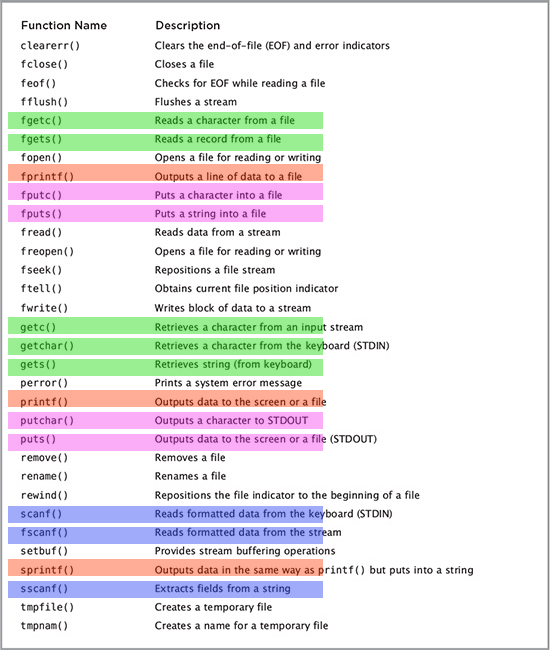

### C/C++ Tips

* 
#define NAME VALUE
and
const TYPE NAME = VALUE
are the same. but the former one is type-free! 👍🏼🙂

* C and C++: atoi() for converting (string) char * to int. type cast doesn’t work! e.g. return value from strtok() which returns char *.

* common stdio.h functions:



* fgets() need to be passed by static char array like: 
    char myArray [];

* if we don’t malloc, all un-malloc-ed variables have a same memory address and are not distinguishable.

* C is a super freaking fucked up language! It may throw an exception (SEG FAULT or something) if you stop it for debugging on functions such as strtok() while you have a real error somewhere later on and your strtok() works fine!

* Seeing \0 (truncation character) in debugger after fgets() or getline() is okay if you have no error in your input file.
